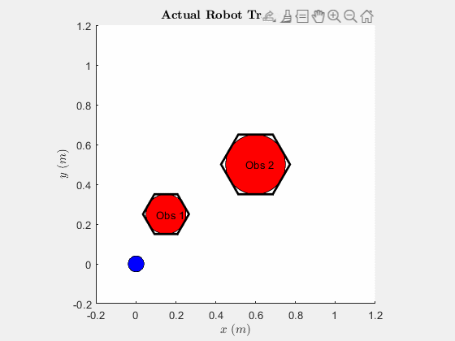
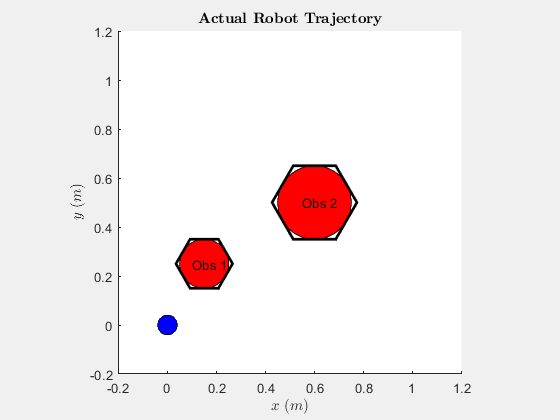

# Motion-planning
Convex Optimization for motion planning, reproduction of the paper "Experimental Study on Optimal Motion Planning of Wheeled Mobile Robot Using Convex Optimization and Receding Horizon Concept"
# Minimizing Trajectory Length

# Minimizing Traversal Time

